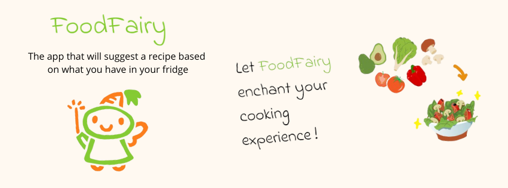
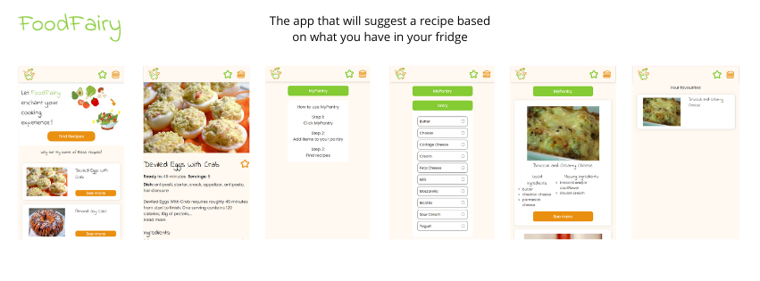
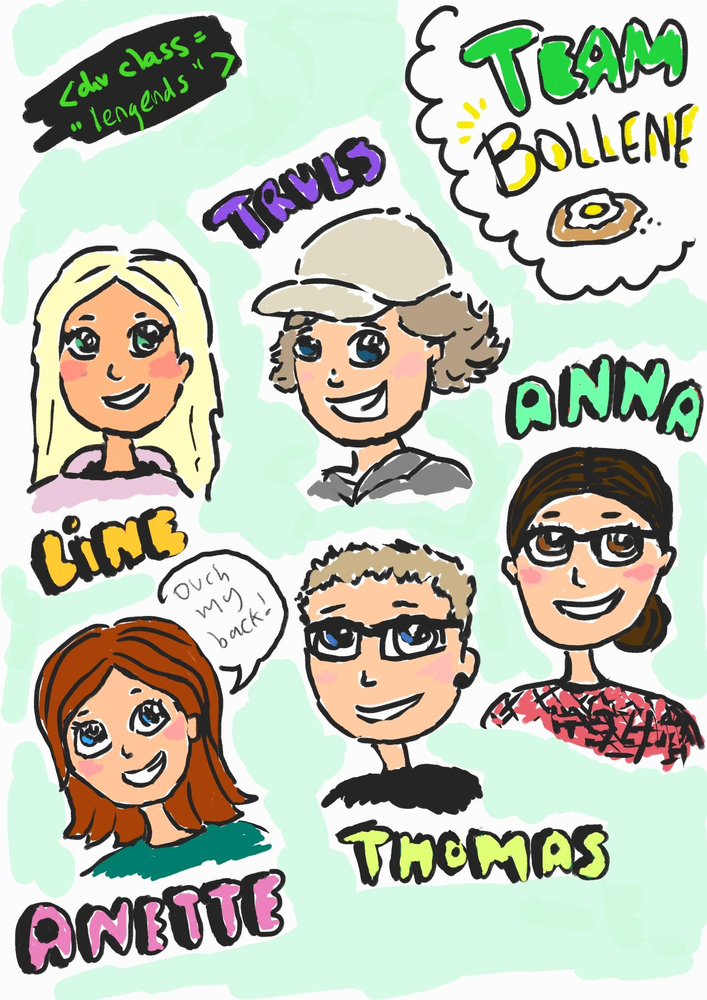

# FoodFairy
This was the group project for Agency 1 during the second semester of Frontend Development at Noroff School of Technology and Digital Media
The project is deployed on netlify [here](https://foodfairy.netlify.app)

## Table of contents:
- [About](#about)
- [Features](#features)
- [Technical Specification](#technical-specification)

## About

Our group project for Agency 1, during the second semester of our Frontend Development course at Noroff School of Technology and Digital Media, was centered around the Agile methodology. The primary objective was to immerse ourselves in an Agile team environment, honing our collaborative skills and problem-solving abilities.

FoodFairy is the result of this group project, it is a website were the user can get recipe recommendations based on the ingredients in their pantry.

## Features

* Homepage:
  * Features random recipes.
* MyPantry function:
  * Allows the user to get recipe recommendations based on the ingredients they have at hand.
  * The API is queried with the food items, and returns recipes using as many food items as possible.
  * The API will try to find recipes where the user has to get as few additional ingredients as possible.
* Recipe details page:
  * The recipe details page features recipe instructions and ingredient amounts.
  ~~~~* The user can~~~~ add recipes to favourites accessible from the navbar.
* The project features hand drawn images and icons.

## Technical Specification

The project was made mobile-first and currently does not feature a desktop version.
The width of the website is capped at a width of 420 px.

### Tech used:
- HTML
- CSS
- JavaScript
- Figma
- Git
- [Spoonacular API](https://spoonacular.com/food-api)

### Deployment:

The site is deployed through Netlify [here](https://foodfairy.netlify.app)

## Team members:

- Anna [GitHub](https://github.com/AnnaSkudsveen)
- Anette [GitHub](https://github.com/elanetto)
- Line [GitHub](https://github.com/LineSvensen)
- Thomas [GitHub](https://github.com/Eikhaugen)
- Truls [GitHub](https://github.com/TrulsJohan)

